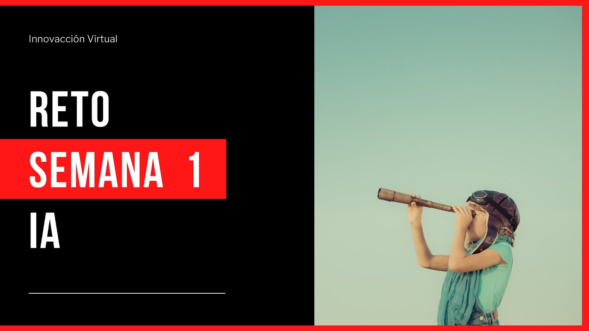

# :notebook_with_decorative_cover: Repositorio Git de Estudio

## :heavy_check_mark: Objetivo de este Repo
Hacer un repo de git de estudio, con los conceptos
que se van aprendiendo en el curso de Inteligencia Artificial de Innovación Virtual. 

## :bookmark: Contenidos

1. [Introducción a los fundamentos de Azure](pages/intro_azure_fundamentals.md)
<!-- 2. [Conceptos Fundamentales](pages/discuss_azure_fundamental_concepts.md)
3. [Componentes Arquitectónicos Principales de Azure](pages/core_azure_architectural_componentes.md)
4. [Servicios de Análisis y Bases de Datos de Azure](pages/azure_db_analytics_services.md) -->

>Participantes:
>- Leonel Castillo Castañeda
>- Francisco Javier Avelar Rosales