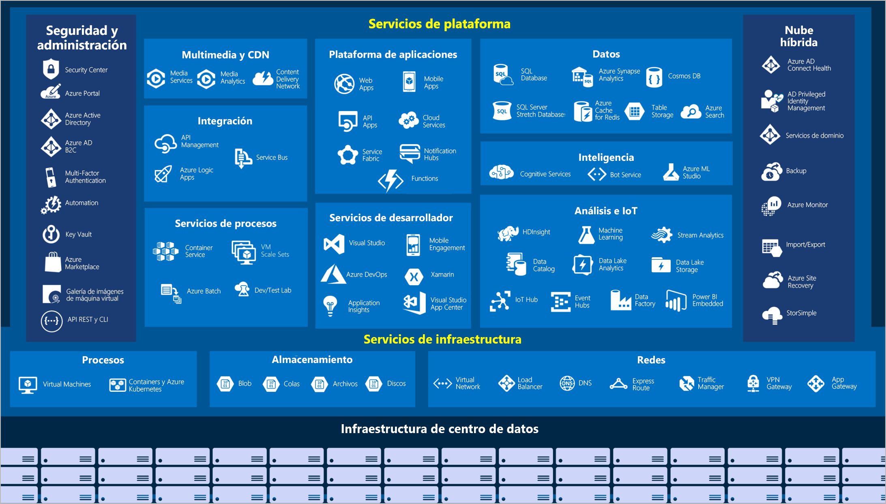

# Introducción a los fundamentos de Azure :eyes:

## ¿Qué es Azure?
Azure es una plataforma de computación en la nube con un conjunto de servicios basados en la nube.

Los servicios de Azure van desde servicios web simples para organizar su presencia comercial en la nube para ejecutar computadoras totalmente virtualizadas para que usted realice sus soluciones de software personalizadas.

__Azure proporciona una gran cantidad de servicios basados en la nube como:__

- _Maquinas Virtuales_
- _Almacenamiento remoto_
- _Alojamiento de bases de datos_
- _Administración de cuentas centralizada_

>__Azure también ofrece nuevas capacidades como:__ 
>- _AI_
>- _Internet de cosas (IOT)_

## ¿Qué es Cloud Computing? :cloud:
Es la entrega de servicios informáticos a través de Internet, que de otro modo se conoce como la nube. 

__Estos servicios incluyen:__
- _Servidores_
- _Almacenamiento_
- _Bases de datos_
- _Redes_
- _Software_
- _Analítica_
- _Inteligencia_

>La computación en la nube ofrece una innovación más rápida, recursos flexibles y economías de escala.

## ¿Por qué la computación en la nube suele ser más barata de usar?
La computación en la nube es la entrega de servicios informáticos a través de Internet mediante el uso de un modelo de precios de Pay-As-You-Go (Paga Mientras Vas). Por lo general, usted paga solo por los servicios en la nube que usa, lo que lo ayuda:

- _Reducir costos operativos_
- _Ejecutar infraestructura de manera más eficiente_
- _Escalar a medida que su negocio necesite_

## ¿Cuáles son algunas ventajas de computación en la nube?
- _Fiabilidad_
- _Escalabilidad_
- _Elasticidad_
- _Agilidad_
- _Geo-distribución_
- _Recuperación de desastres_

## ¿Qué son los modelos de servicio en la nube?
Estos modelos definen el nivel diferente de responsabilidad compartida de que un proveedor de la nube y un inquilino de la nube son responsables.

Algunos ejemplos son:
- __IaaS__
    - Este modelo de servicio en la nube es el más cercano al manejo de servidores físicos.
- __PaaS__
  - Este modelo de servicio en la nube es un entorno de alojamiento administrado.
- __SaaS__
  - En este modelo de servicio en la nube, el proveedor de la nube gestiona todos los aspectos del entorno de la aplicación, como máquinas virtuales, recursos de redes, almacenamiento de datos y aplicaciones.

## ¿Qué es la computación sin servidor?
La computación no servidor permite a los desarrolladores crear aplicaciones más rápido eliminando la necesidad de que administren la infraestructura.

_Con las aplicaciones sin servidores, el proveedor de servicios de la nube ofrece automáticamente:_
  - las disposiciones 
  - escalas 
  - y administra la infraestructura necesaria para ejecutar el código.

__Puntos Importantes:__
- Las arquitecturas sin servidor son altamente escalables y impulsadas por eventos.
- Utilizan recursos solo cuando se produce una función específica o desencadenante.

_Al comprender la definición de la computación no servidor, es importante tener en cuenta que los servidores todavía están ejecutando el código._

>El nombre sin servidor proviene del hecho de que las tareas asociadas con el aprovisionamiento y la administración de la infraestructura son invisibles para el desarrollador.

## ¿Qué son las nubes públicas, privadas e híbridas?

- __Pública__
  - Se ofrecen servicios en Internet pública y están disponibles para cualquier persona que quiera comprarlos.
- __Privada__
  - Los recursos informáticos son utilizados exclusivamente por los usuarios de una empresa u organización.
- __Híbrida__
  - Este entorno de computación combina una nube pública y una nube privada al permitir que los datos y las aplicaciones se compartan entre ellos.

# ¿Qué puedo hacer con Azure?
Azure proporciona más de cien servicios que permiten hacer todo tipo de cosas: desde ejecutar las aplicaciones existentes en máquinas virtuales hasta explorar nuevos paradigmas de software, como bots inteligentes y realidad mixta.

## ¿Cómo funciona Azure?
- Es una plataforma nube pública y privada.
- Utiliza tecnología llamada virtualización.
- Usa el Hypervisor para emular todas las funciones de una computadora en una maquina virtual y demás.
- _Cada servidor tiene sus propios Hypervisor_
    >- Tienen un network switch para conectar todos los servers
    >- Están conectados a un ORCHESTRATOR
     >   - Desde el portal de azure y mediante un api se conectan al orchestrator y por ese a lo demás
  > - Corren un Fabric Controller

## ¿Qué es Azure Portal?
Azure Portal es una consola unificada basada en web que proporciona una alternativa a las herramientas de línea de comandos. 

Con Azure Portal, puede administrar la suscripción de Azure mediante una interfaz gráfica de usuario. Puede:

- Compilar, administrar y supervisar todo, desde aplicaciones web sencillas hasta complejas implementaciones en la nube.
- Crear paneles personalizados para una vista organizada de recursos.
- Configurar opciones de accesibilidad para una experiencia óptima.

>Azure Portal está diseñado para proporcionar resistencia y disponibilidad continua.

>Mantiene una presencia en todos los centros de datos de Azure. 

>Esta configuración hace que Azure Portal sea resistente a los errores de centros de datos individuales y evita que se ralentice la red al estar cerca de los usuarios. 

>Azure Portal no deja de actualizarse y no requiere tiempo de inactividad para las actividades de mantenimiento.

## ¿Qué es Azure Marketplace?
Azure Marketplace facilita la conexión entre los usuarios y los partners de Microsoft, proveedores de software independientes y nuevas empresas que ofrecen sus soluciones y servicios, optimizados para ejecutarse en Azure. 

Los clientes de Azure Marketplace pueden buscar, probar, comprar y aprovisionar aplicaciones y servicios de cientos de los principales proveedores de servicios. 

__Todas las soluciones y los servicios están certificados para ejecutarse en Azure.__

# Servicios de Azure

## Las categorías que se usan con más frecuencia:

## _Proceso_
>Los servicios de proceso a menudo son una de las razones principales de por qué las compañías se cambian a la plataforma Azure.

>Azure proporciona una amplia gama de opciones para hospedar aplicaciones y servicios.

Ejemplos:
1. Azure Virtual Machines
2. Azure Batch
3. Azure Container Instances
4. Azure Table Functions

## _Redes_
>La vinculación de recursos de proceso y el suministro de acceso a las aplicaciones es la función clave de la red de Azure. 

>La funcionalidad de red de Azure incluye una gama de opciones para conectar el mundo exterior a servicios y características de los centros de datos globales de Azure.

Ejemplos:
1. Azure Virtual Network
2. Azure VPN Gateway
3. Azure DDoS Protection
4. Azure Firewall

## _Almacenamiento_
>Azure proporciona cuatro tipos principales de servicios de almacenamiento:

1. Azure Blob Storage
2. Azure File Storage
3. Azure Queue Storage
4. Azure Table Storage

## _Móvil_
>Con Azure, los desarrolladores pueden crear servicios de back-end móviles para aplicaciones iOS, Android y Windows de forma rápida y sencilla.

Otras características de este servicio:
- Sincronización de datos sin conexión.
- Conectividad a datos locales.
- Difusión de notificaciones de inserción.
- Escalado automático para satisfacer las necesidades del negocio.

## _Bases de datos_
>Azure proporciona varios servicios de base de datos para almacenar una gran variedad de volúmenes y tipos de datos. 

>Y con la conectividad global, los usuarios disponen de estos datos al instante.

Ejemplos:
1. Azure Cosmos DB
2. Azure SQL Database
3. Azure Database Migration Service
4. Azure Database for MariaDB

## _Web_
>Azure incluye soporte técnico de primera clase para compilar y hospedar aplicaciones web y servicios web basados en HTTP. 

Los siguientes servicios de Azure se centran en el hospedaje web:
1. Azure App Service
2. Azure API Management
3. Azure SignalR
4. Azure Notification Hubs

## _IoT_
>Muchos servicios pueden ayudar e impulsar soluciones de un extremo a otro para IoT en Azure.

Ejemplos:
1. IoT Central
2. Azure IoT Hub
3. IoT Edge

## _Macrodatos_
>Se han desarrollado tecnologías de clúster de código abierto para tratar con estos grandes conjuntos de datos. 

>Azure admite una amplia gama de tecnologías y servicios para proporcionar soluciones de análisis y macrodatos.

Ejemplos:
1. Azure Synapse Analytics
2. HDInsight de Azure
3. Azure Databricks
  
  
## _Inteligencia Artificial_
>En el contexto de la informática en la nube, la inteligencia artificial se basa en una amplia gama de servicios, donde el principal es el aprendizaje automático. 

>El aprendizaje automático es una técnica de ciencia de datos que permite a los equipos utilizar datos existentes para prever tendencias, resultados y comportamientos futuros. 

>Mediante el aprendizaje automático, los equipos aprenden sin necesidad de programarlos explícitamente.

Estos son algunos de los tipos de servicios de inteligencia artificial y aprendizaje automático más comunes de Azure:
1. Azure Machine Learning Service
2. Azure ML Studio

__Cognitive Services__ _es un conjunto de productos estrechamente relacionados._

Puede usar estas API precompiladas en las aplicaciones para solucionar problemas complejos.

Ejemplos de Cognitive Services:
1. Visión
2. Voz
3. Asignación de Conocimiento
4. Bing Search
5. Procesamiento de lenguaje natural

## _DevOps_
>DevOps reúne a individuos, procesos y tecnología mediante la automatización de la entrega de software para ofrecer un valor continuo a los usuarios. 

>Con Azure DevOps puede crear, compilar y publicar canalizaciones que proporcionan integración, entrega e implementación continuas a las aplicaciones.

Ejemplos:
1. Azure DevOps
2. Azure DevTest Labs

# Cuentas de Azure

## ¿Qué es la cuenta gratuita de Azure?
La cuenta gratuita de Azure incluye lo siguiente:

- Acceso gratuito a productos populares de Azure durante 12 meses.
- Crédito para gastar durante los primeros 30 días.
- Acceso a más de 25 productos que siempre son gratuitos.

## ¿Qué es el espacio aislado de Azure?
Esta suscripción temporal le permite crear recursos de Azure para la duración de un módulo de Learn. 

>Learn limpia de forma automática los recursos temporales una vez que haya completado el módulo.

Cuando complete un módulo de Learn, puede usar la suscripción personal para finalizar los ejercicios que incluye. Pero el espacio aislado es el método preferido para usar, ya que permite crear y probar recursos de Azure sin costo alguno.

